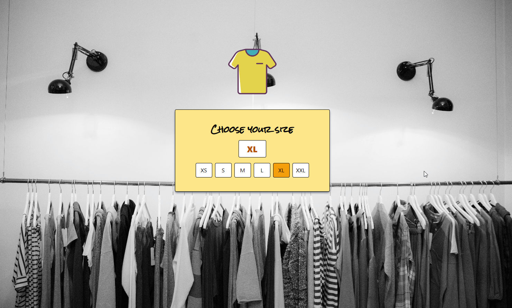

# VueJS + Typescript Application Size Selector


------------------
### A simple web application using Vuejs with Typescript. This app allow choose the size of a yellow srhit

-------------------
# Requirmentes
+ VueJs 3
+ Node 17 or Higher
+ Knowlege with typescript
+ TailwindCss
-------------------
# Installation
+ Install all dependencies with
```
npm install
```
+ Run as developer
```
npm run dev
```
+ Build the Project 
```
npm run build
```
+ Note: This app vite serve it on localhost port 5173. Enter to the router on your browser
localhost:5173
+ Options with docker to build image
```
docker build -t sizeselector .
```
+ Running the new docker image created 
```
docker run -it -p 8080:8080 sizeselector
```
-------------------
# Preview

------------------
[Visit the creator's repository](https://github.com/userlg)
------------------
